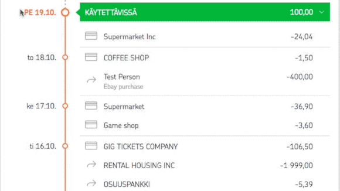

# Budgetting tool with support for selected banks

Personal budgetting with easy copy-pasting rows from a few selected online bank services (Currently OP, Nordea planned). 

IndexedDb is used to remove the need for backend completely to have all user data in their own machines only.

Master branch is built automatically to heroku: https://budjetti.herokuapp.com

Service in Finnish only, sorry. 

## Development

- Run `npm install`
- Run `npm start`
